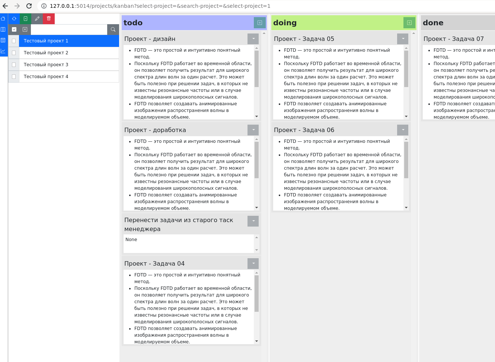

# wapp_task_manager_flask

Таск менеджер на flask.

- [ ] проекты
    - [ ] канбан
    - [ ] список задач
- [ ] заметки
    - [ ] стартовая страница-заметка
- [ ] метрики
- [ ] файлы




## Вырианты запуска приложения

### flask

```bash
build.sh flask
```

### zipapp

```bash
build.sh zipapp run
```

### pyinstaller

```bash
build.sh pyinst_docker run
```

## Как делается релиз

1. Меняем версию, если требуется

```bash
echo 'v0.3' > VERSION
```

2. Выполняем скрипт релиза

- `pyinst` сборка pyinstaller
- `zipapp` сборка zipapp
- `all` для всех

```bash
./release-code.sh all
```

В результате коммитется текущий код и дается тэг текущей версии.
Создается релиз.
После упаковывается проект и прикрепреляется к релизу.
